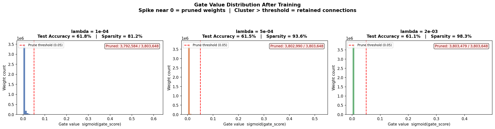

# Self-Pruning Neural Network (Tredence Case Study)

## Overview

This project implements a self-pruning neural network that learns to remove unnecessary weights during training using learnable sigmoid gates and L1 regularization.

## Key Idea

Each weight is assigned a learnable gate:

* Gate = sigmoid(score) ∈ (0,1)
* Weight × Gate → controls importance
* L1 penalty pushes unimportant gates toward 0

This allows the network to automatically identify and remove redundant connections.

## Features

* Custom `PrunableLinear` layer
* Learnable gating mechanism
* L1 sparsity regularization
* Warmup phase for stable training
* CIFAR-10 dataset

## Results

| Lambda | Accuracy | Sparsity |
| ------ | -------- | -------- |
| 1e-4   | 61.84%   | 81.2%    |
| 5e-4   | 61.54%   | 93.6%    |
| 2e-3   | 61.11%   | 98.3%    |

👉 Achieves **~98% sparsity with minimal accuracy loss**

## Visualization



## How to Run

```bash
pip install torch torchvision matplotlib
python self_pruning_network.py
```

## Project Structure

* `self_pruning_network.py` — main implementation
* `report.md` — detailed explanation and analysis
* `gate_distributions.png` — pruning visualization

## Author

Pranav Changa
